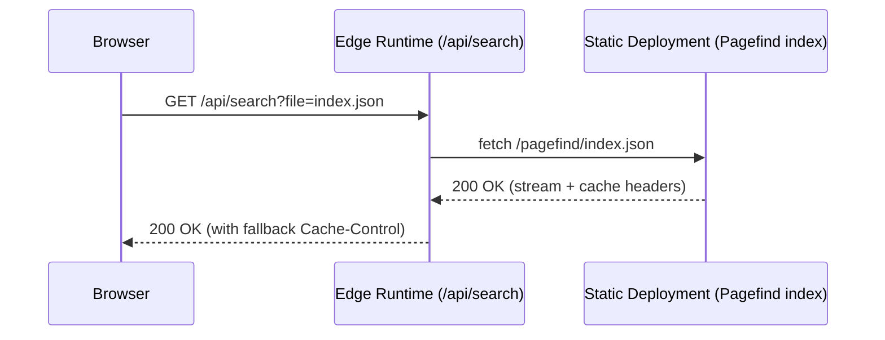
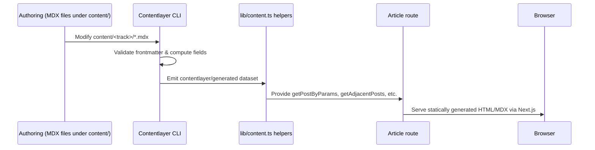

# Architecture Overview

This document captures the runtime topology, module relationships, and request/data flows for the sreekaratla.com codebase.

## System Context
```mermaid
flowchart LR
  Visitor((Visitor))
  Browser[Next.js App Router UI]
  EdgeFuncs[Edge Runtime Routes\n(e.g., /api/search)]
  NodeFuncs[Node Runtime Routes\n(e.g., /api/preview)]
  Contentlayer[(Contentlayer Generated Data)]
  Pagefind[(Pagefind Static Index)]
  Storage[(Static Assets\n/ public/)]
  Deployment[Vercel / Cloudflare Pages]

  Visitor --> Browser
  Browser --> EdgeFuncs
  Browser --> NodeFuncs
  Browser --> Storage
  EdgeFuncs --> Pagefind
  NodeFuncs --> Contentlayer
  Contentlayer --> Deployment
  Storage --> Deployment
  Pagefind --> Deployment
  Deployment --> Visitor
```

## Module Dependencies
Key server helpers and UI routes consume the Contentlayer dataset and site configuration utilities.

```mermaid
flowchart TD
  subgraph Content Pipeline
    ContentlayerConfig[contentlayer.config.ts]
    Scripts[scripts/contentlayer-build.mjs]
    Generated[contentlayer/generated]
    ContentHelpers[lib/content.ts]

    ContentlayerConfig --> Generated
    Scripts --> Generated
    Generated --> ContentHelpers
  end

  subgraph Lib Helpers
    Config[lib/config.ts]
    DateUtils[lib/date.ts]
    SEO[lib/seo.ts]
    MDX[lib/mdx.tsx]
    RSS[lib/rss.ts]
  end

  subgraph App Routes
    ArticlePage[app/(blog)/[category]/[slug]/page.tsx]
    Tracks[app/(marketing)]
    ApiSearch[app/api/search/route.ts]
    ApiPreview[app/api/preview/route.ts]
    Sitemap[app/sitemap.ts]
  end

  ContentHelpers --> ArticlePage
  ContentHelpers --> Tracks
  ContentHelpers --> Sitemap
  RSS --> Sitemap
  Config --> ArticlePage
  Config --> Tracks
  Config --> ApiPreview
  DateUtils --> ArticlePage
  MDX --> ArticlePage
  Generated --> ApiSearch
  RSS --> Tracks
  SEO --> Tracks
```

## Request & Data Flows
The following sequence diagrams illustrate representative runtime paths.

### `/api/search`


### Content Build & Article Rendering


## Runtime Choices
- `/api/search` is explicitly configured for the Edge runtime so it can stream Pagefind assets with low latency and fallback caching semantics. 【F:app/api/search/route.ts†L1-L28】
- `/api/preview` runs on the default Node runtime to access `draftMode()` and validate the shared secret stored in environment variables. 【F:app/api/preview/route.ts†L1-L24】
- Article routes pre-render at build time with `generateStaticParams()` and `dynamicParams = false`, ensuring predictable static output served from the deployment CDN. 【F:app/(blog)/[category]/[slug]/page.tsx†L24-L82】

## Content & Data Pipeline
- MDX posts under `content/` are processed by Contentlayer, with schema validation and computed fields declared in `contentlayer.config.ts`. 【F:contentlayer.config.ts†L1-L71】
- The `scripts/contentlayer-build.mjs` wrapper runs the Contentlayer CLI (with Windows compatibility fixes) and retries after automated frontmatter correction when necessary. 【F:scripts/contentlayer-build.mjs†L1-L55】
- Runtime helpers in `lib/content.ts` filter, sort, and map the generated dataset for routes, including draft-aware variants for preview mode. 【F:lib/content.ts†L1-L109】

## Deployment Considerations
- `pnpm build` composes the Contentlayer build, Next.js static generation, and post-build RSS/sitemap scripts, yielding a fully static artifact suited to Vercel or Cloudflare Pages deployments. 【F:README.md†L31-L72】
- Edge functions and static assets should be deployed to the same platform to keep `/api/search` close to the CDN-hosted Pagefind index. 【F:app/api/search/route.ts†L1-L28】
- Ensure environment variables (preview token, social URLs, analytics IDs) are provided at deploy time so generated metadata, routes, and preview mode behave consistently. 【F:README.md†L19-L47】
